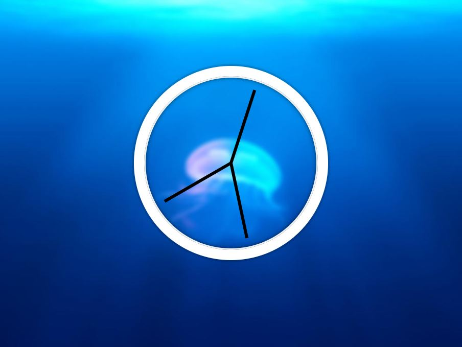

# JavaScript and CSS clock
> This is very nice clock based on CSS and JavaScript. Hand of seconds get a little shaking when it is going to move by transition with *cubic bezier* CSS function.

## Screenshots

## Technologies
* HTML
* CSS
* JavaScript
* GIT

## Status
Project is: *done*

## Inspiration
Project based on JavaScript30 course by Wes Bos.

## Contact
Created by [Damian Jackiewicz](https://www.linkedin.com/in/damian-jackiewicz/) - feel free to contact me!
